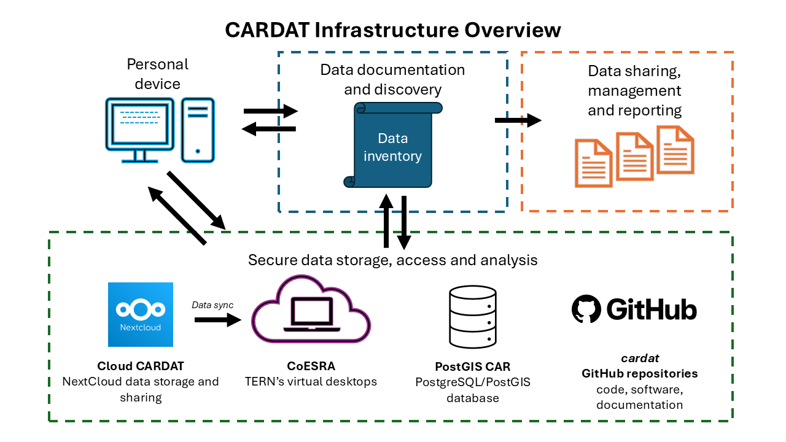



{fig-alt="CARDAT infrastructure overview"}

CARDAT maintains a series of assets for air quality and health research. Where possible, data and software adheres to the [FAIR principles](https://ardc.edu.au/resource-hub/making-data-fair/) - Findable, Accessible, Interoperable and Reusable.

Data files are stored on [Cloud CARDAT][cardat-data-repo], a cloud-based data storage system. A small portion of data is stored in the PostGIS CAR database. Software, such as code tools, R packages, and scientific workflows, are held in the [CARDAT GitHub repository][cardat-gh].

A catalogue of data and software assets are maintained in the [CARDAT Data Inventory][cardat-data-inventory].

A portion of CARDAT data is copied to the [CoESRA][coesra] platform, a cloud-based virtual desktop service provided by [TERN][tern-home] where analyses may be performed.

