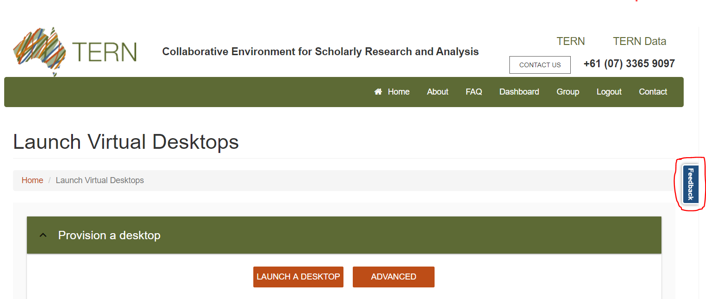

<h2><abbr title="Centre for Air pollution, energy and health Research Data Analysis Technology">CARDAT</abbr> - getting help</h2>

<h3>Reporting issues and getting help</h3>

For help please use the following emails - please be sure to include as much relevant information as you can when reporting issues or asking questions.

<ul>
<li><a href="mailto:car.data@sydney.edu.au">CAR Data Team</a> &mdash; this email should be used for any questions about getting started, help with examples, advice on data, requests or general feedback.
Please note that the email box is monitored regularly several times per week, but it may take a day or two to respond to your email.</li>
<li>Issues with CoESRA - these should be reported via the CoESRA website feedback form found on the right hand side of the screen.

<li>Issues with CloudStor - these should be reported via the CloudStor Contact us webpage <a href="https://www.aarnet.edu.au/contact-us">https://www.aarnet.edu.au/contact-us</a></li>
</ul>
<h3>Known issues and workarounds</h3>

<abbr title="Centre for Air pollution, energy and health Research Data Analysis Technology">CARDAT</abbr> involves tvo third party software platforms:

<ul>
<li>CloudStor (supported by AARNet)</li>
<li><abbr title="Collaborative Environment for Scholarly Research and Analysis">CoESRA</abbr> (supported by <abbr title="Terrestrial Ecosystem Research Network">TERN</abbr>)</li>
</ul>

 While both of these platforms are professionally supported, they are both still being developed and there are stils a few issues that are known to occur. 
<a href="#table_1">Table 1</a> provides a list of some of the known issues and workarounds.

<table id="table_1">
<caption>Table 1: Known issues and workarounds in CoESRA and CloudStor</caption>
<tr>
<th>Platform</th>
<th>Issue</th>
<th>Workaround</th>
<th>Comments</th>
</tr>
<tr>
<td>CoESRA</td>
<td>R files do not open with RStudio. Currently there is no file association between RStudio and file extensions such as .R .Rproj .Rmd</td>
<td>Open RStudio via the Applications -> CoESRA menu. Then open the file from within RStudio.</td>
<td>This issue has been reported to TERN.</td>
</tr>
<tr>
<td>CoESRA</td>
<td>Arrow keys sometimes stop working from within RStudio.</td>
<td>This can be resolved through closing and reopening RStudio.</td>
<td>This issue has been reported to TERN.</td>
</tr>
<tr>
<td>CloudStor</td>
<td>Occasionally logins fail.</td>
<td>No known workaround.</td>
<td>When this issue occurs it needs to be reported to the CloudStor help desk, who can resolve the issue.</td>
</tr>
<!--	<tr>
<td></td>
<td></td>
<td></td>
<td></td>
</tr> -->
</table>
